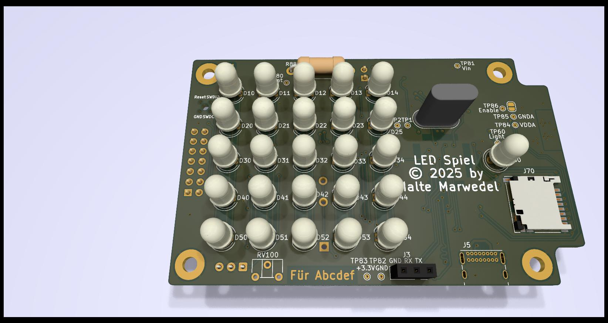

# LED Spiel

## Idea

Add some RGB LEDs in a box with sound. Fun for kids.

## Features

- 5x5 RGB LEDs

- Mono sound output

- Up to 7 inputs for buttons

- Measure brightness of environment to adjust LED brigtness

- IR receiver allows every remote control to become an extra toy

- Runs with two rechargeable NIMH AAA batteries. Non rechargeable ones work too.

- Slow charge over USB (~80mA). Can be disabled for non rechargeable batteries.

- SD card for storing sound and LED sequences

- SD card data exchange and firmware upload over USB

- The STM32F405 MCU is fast enough for mp3 decoding

- Costs for all parts is ~90€.

## Status

The PCB design has been send to a manufacturer.