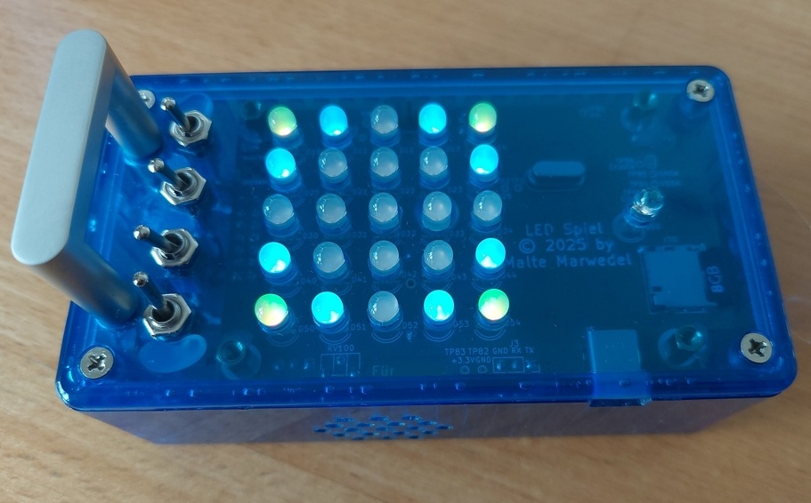
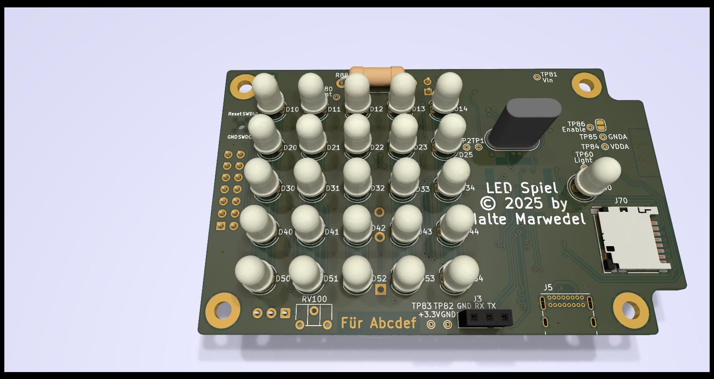
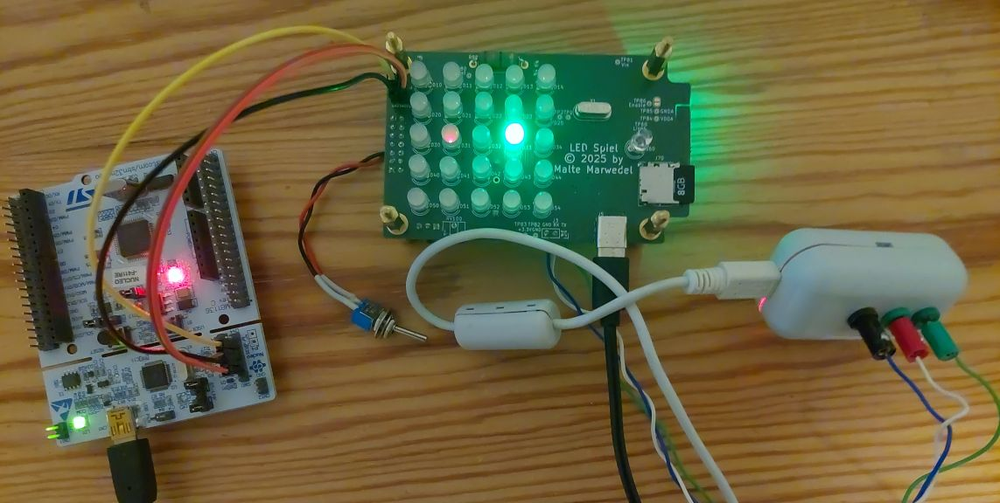

# LED Spiel

## Idea

Add some RGB LEDs in a box with sound. Fun for kids.

## Features

- 5x5 RGB LEDs

- Mono sound output

- Up to 7 inputs for buttons

- Measure brightness of environment to adjust LED brigtness

- IR receiver allows every remote control to become an extra toy

- Runs with two rechargeable NIMH AAA batteries. Non rechargeable ones work too.

- Slow charge over USB (~80mA). Can be disabled for non rechargeable batteries.

- SD card for storing sound (mp3 files) and LED sequences

- SD card file exchange and firmware upload over USB

- The STM32F405 MCU is fast enough for mp3 decoding

- Costs for all parts is ~95€.

## Status

The PCB is soldered, the case is complete, the software for the toy works, but is incomplete.

Two push buttons are on the left side, if one is pressed during power up, the device enters DFU firmware download mode.

Four switches are there for selecting songs.

Some animations are available.

Missing featues:

- Data exchange over USB mass storage is slow and only working in the Device -> PC direction (read only drive).

- The IR receiver is currently unused.

## History

Planning...

Soldering and debugging...

